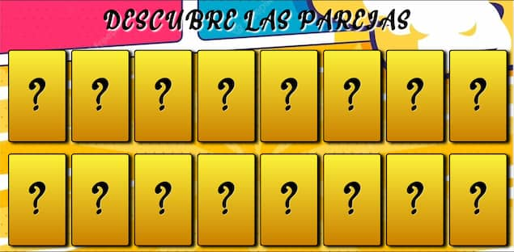

# 🎮 Descubre Parejas

> Un juego de memoria desarrollado con JavaScript Vanilla, HTML y CSS



## 📝 Descripción

**Descubre Parejas** es un emocionante juego de memoria donde deberás encontrar todas las parejas de emojis ocultos detrás de las cartas. ¡Demuestra tu capacidad de memorización minimizando el número de intentos!

## ✨ Características Principales

- 🎨 **Interfaz Atractiva** - Diseño moderno y atractivo implementado con HTML y CSS
- 🧠 **Lógica Robusta** - Desarrollado con JavaScript Vanilla puro
- 🎯 **Desafiante** - Pon a prueba tu memoria encontrando las parejas en el menor número de intentos

## 🎲 Cómo Jugar

1. Visita [Descubre Parejas](https://descubre-parejas.vercel.app/) en tu navegador
2. ¡Comienza a jugar!

## 📋 Reglas del Juego

- 🎴 16 cartas inicialmente tapadas
- 👆 Haz clic en 2 cartas para revelar sus emojis
- ✅ Las cartas coincidentes permanecerán destapadas
- ❌ Las cartas no coincidentes se ocultarán después de 1 segundo
- 🎯 Objetivo: Encuentra todas las parejas con el mínimo de intentos

## 📁 Estructura del Proyecto

```
descubre-parejas/
├── index.html      # Estructura base de la página
├── css/           # Estilos y animaciones
├── js/            # Lógica del juego (main.js)
├── fonts/         # Tipografías
└── images/        # Recursos gráficos optimizados
